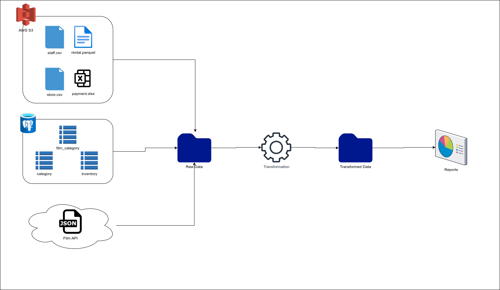
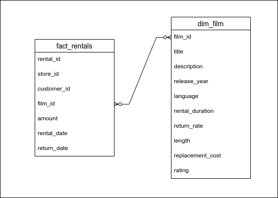

# Assignment 2

## Problem Statement

DvDRental Solutions is a company that provides Movie DvDs on rent to customers.

They have multiple systems that generate data and store it in various formats in AWS & Azure Cloud.

As a Data Engineer, our job is to create an ETL pipeline for the above statement and generate reports based on below mentioned business requirements.

## Business Report

1. Top 10 Most Rented Movies
2. Top 5 Most Revenue Generating Movies

## Data Sources

They have 8 data sources:

**AWS S3 Bucket**

| # | File |
| --- | --- |
| 1. | rental.parquet |
| 2. | payment.xlsx |
| 3. | staff.csv |
| 4. | store.csv |

**Azure PostgreSQL Database**

| # | Table |
| --- | --- |
| 1. | film_category |
| 2. | category |
| 3. | inventory |

**REST API**

[Films API](https://raw.githubusercontent.com/Shoaib720/dvdrental-csv/main/film.json)


## Requirements
1. Python
2. SQL Database (PostgreSQL)

## Architecture

ER Diagram for DVD Rental Database


ETL Pipeline architecture



# ETL

## Extraction

The ingestion phase, extracts data from all the 8 sources and store the files in `raw_data` folder.

The `raw_data` folder has date wise subfolders.

```
raw_data/
  2023-12-13/
  2023-12-14/
  2023-12-15/
```

## Transformation

This phase, picks the `raw_data` files, converts them to PySpark DataFrames, then converts the schema to Star Schema by joining the dataframes.

The Star Schema is as shown below



## Load

This stage converts the `fact_rental` and `dim_film` tables to `parquet`

```
transformed_data/
  2023-12-13/
  2023-12-14/
  2023-12-15/
```

## Reporting

This stage performs the following:
- Loads data from the `transformed_data` folder and coverts them to PySpark Dataframes.
- Performs join using `PySpark.Dataframe.join` based on business problem and converts it to dataframe.
- Generates horizontal barplots using `seaborn` library and saves it to `plots` folder.
- Creates a PDF report using `fpdf` library.
